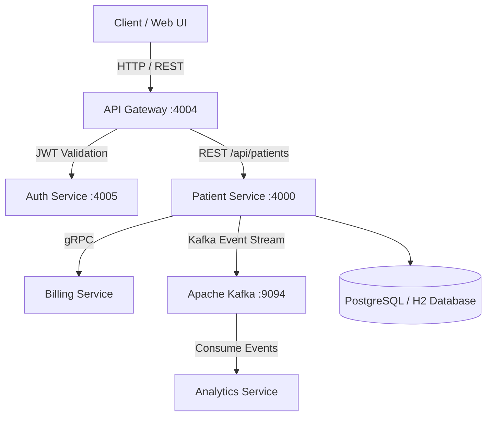

<div align="center">

# Patient Management Service

[](https://www.oracle.com/java/)
[](https://spring.io/projects/spring-boot)
[](https://nextjs.org/)
[](LICENSE)

*An automated microservices, patient management, and service gateway application.*

</div>

---

## 📌 Overview
An enterprise-grade, distributed microservices platform built with Spring Boot and Java 17+. The system provides end-to-end management for patient records, centralized authentication with API gateway routing and JWT validation, inter-service gRPC communication for billing, and real-time Kafka event streaming for analytics.

---

## 🏗️ System Architecture
The following high-level architecture diagram illustrates the end-to-end request flow, client-server interactions, and service integrations:



---

## 🛠️ Tech Stack

### Microservices
* **API Gateway (`api-gateway`):** Spring Cloud Gateway with custom JWT validation filters.
* **Auth Service (`auth-service`):** User authentication, password hashing, and JWT token issuance.
* **Patient Service (`patient-service`):** Patient profile management, CRUD operations, Kafka producer, gRPC client.
* **Billing Service (`billing-service`):** High-performance gRPC server handling billing events.
* **Analytics Service (`analytics-service`):** Event-driven Kafka consumer processing real-time telemetry.
* **Integration Tests (`integration-tests`):** End-to-end suite validating full cross-service interaction.

### Backend & Infrastructure
* **Core:** Java 17+, Spring Boot 3.x
* **Inter-service Communication:** REST APIs, gRPC (Protobuf), Apache Kafka
* **Database & Caching:** PostgreSQL / H2 in-memory
* **Build Tool:** Maven (Multi-module build)

---

## ⚙️ Getting Started

### Prerequisites
Make sure you have the following installed on your local machine:
* Java Development Kit (JDK 17+)
* Apache Maven
* Docker (for Kafka and containerized deployment)

### Installation & Local Setup

1. **Clone the repository:**
   ```bash
   git clone https://github.com/MSree1737/patient-service.git
   cd patient-management
   ```

2. **Build the multi-module project:**
   ```bash
   ./mvnw clean install -DskipTests
   ```

3. **Start the services:**
   You can start each service individually using Maven or your IDE:
   - **Auth Service:** `cd auth-service && ../mvnw spring-boot:run` (Runs on port 4005)
   - **API Gateway:** `cd api-gateway && ../mvnw spring-boot:run` (Runs on port 4004)
   - **Patient Service:** `cd patient-service && ../mvnw spring-boot:run` (Runs on port 4000)
   - **Billing Service:** `cd billing-service && ../mvnw spring-boot:run`
   - **Analytics Service:** `cd analytics-service && ../mvnw spring-boot:run`

---

## 📄 License
This project is licensed under the MIT License - see the [LICENSE](LICENSE) file for details.
